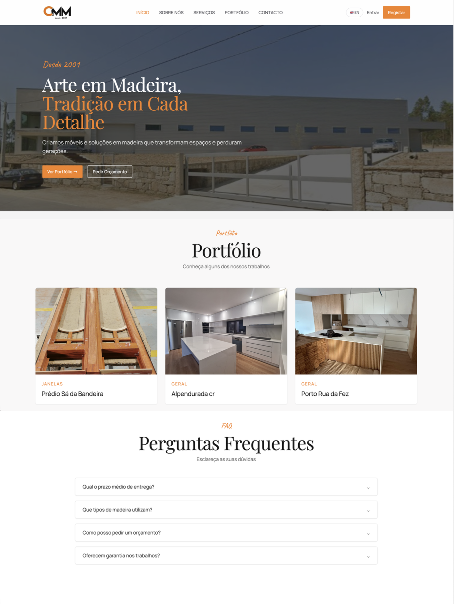
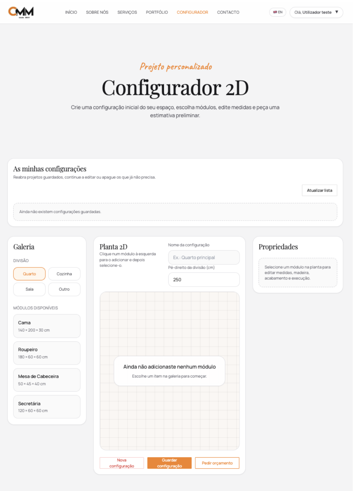
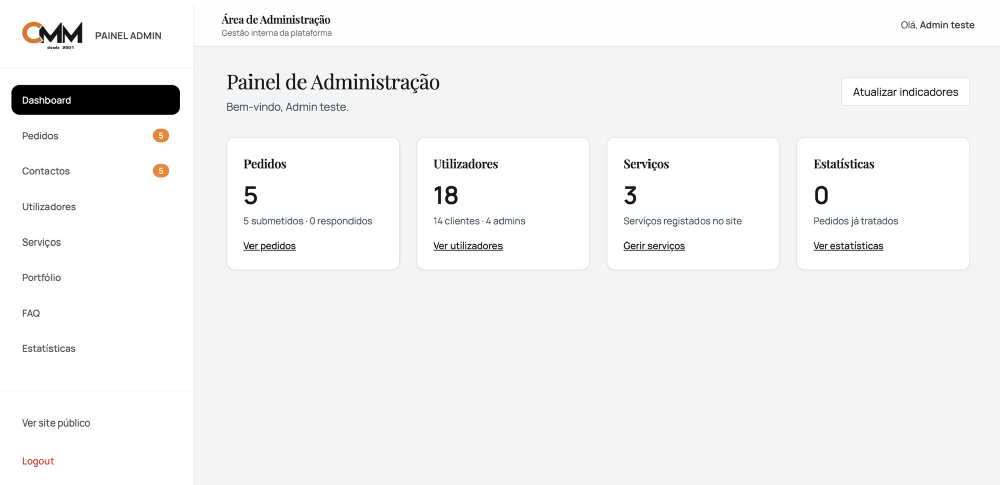

# Mariana Monteiro — Project Portfolio

Welcome to my project portfolio.

I am a Computer Engineering graduate with a particular interest in **Front-End Development** and web applications. I also have experience with **Java** and **Spring Boot**, and I am currently looking for a paid internship or junior opportunity where I can strengthen my practical skills, contribute to real-world projects and grow as a software developer.

This repository presents a selection of my individual, academic and collaborative projects. Some source code is private due to client or team restrictions, but screenshots, demonstrations and information about my contributions are available below.

---

## Featured Projects

### Carpentry Web Platform

An individual Final Year Project developed for a real carpentry business.

The platform was designed to provide the company with an online presence while also offering customers tools to explore services, view previous work, request quotations and configure custom furniture.

  
  

  

**My role:**  
Full project development, including interface design, front-end development, back-end development and database integration.

**Technologies:**
- React
- JavaScript
- Java
- Spring Boot
- PostgreSQL
- HTML
- CSS

**Main features:**
- User registration and authentication
- Email MFA verification
- Administrative dashboard
- Portfolio and service management
- 2D furniture configurator
- Configuration history
- Budget requests
- Automatic estimates
- Contextual chatbot

> The source code is private because the platform was developed for a real business. The project is currently undergoing final adjustments before deployment.

---

### Meeter AI

A collaborative project focused on meeting management, analysis and productivity.

**My contribution:**
- Front-End development
- Interface implementation
- UI design and mockups
- Responsive design improvements
- Accessibility and usability analysis
- Application testing

**Project status:** In development.

> The source code is private due to the collaborative and potentially commercial nature of the project. The main repository is maintained by another team member.

---

### Portly — Smart Video Intercom

An Embedded Systems project that combines a Raspberry Pi, physical hardware and a mobile application to create a smart video intercom.

The system allows users to receive doorbell events, view live video, communicate through audio and remotely open the door through a mobile application.

**My contribution:**
- Mobile application development
- Raspberry Pi server integration
- Camera and audio communication
- GPIO and hardware integration
- Servo motor integration
- LCD and doorbell functionality
- System testing and troubleshooting

**Technologies and components:**
- React Native
- Expo
- Node.js
- Python
- Raspberry Pi
- WebSockets
- GPIO
- Camera
- Microphone
- Bluetooth speaker
- LCD
- Servo motor

**Links:**
- [View public repository](https://github.com/juliassantoss/portly)
- [Watch project demonstration](https://drive.google.com/file/d/1RMozq5w_S3Bwz165n5C4yrOK10QNaAFA/view?usp=sharing)

> This was a collaborative project and the main repository is maintained by another team member.

---

### Do Re Mi Shop

A Java web application developed as an academic project for managing an online music store.

The application includes different areas for customers, administrators, employees and suppliers, supporting both online purchases and physical store management.

**My contribution:**  
I was responsible for the implementation and development of the application code.

**Main features:**
- User registration and authentication
- Product search
- Shopping cart management
- Purchase confirmation
- Product management
- Sales registration
- Inventory management
- Customer evaluations
- Different user roles

**Technologies:**
- Java
- JSP
- Java Servlets
- JavaScript
- HTML
- CSS
- MySQL

**Repository:** [View project](https://github.com/MarianaMonteiro79/do-re-mi-shop)

---

### WeatherStation+

An Android application developed to display and analyse data collected from a weather station.

The application presents the latest temperature, humidity and air quality readings. Users can also select a type of measurement and time interval to analyse historical data through charts.

**Main features:**
- Latest weather station readings
- Temperature monitoring
- Humidity monitoring
- Air quality particle monitoring
- Data type selection
- Time interval selection
- Historical data visualisation
- Average calculation
- Moving average visualisation
- Trend visualisation

**Technologies:**
- Kotlin
- Android Studio
- Firebase Firestore

**Repository:** [View project](https://github.com/MarianaMonteiro79/weatherstation-plus)

---

## Contact

-  [LinkedIn](https://www.linkedin.com/in/marianafmmonteiro/)
-  [marianafmmonteiro@gmail.com](mailto:marianafmmonteiro@gmail.com)
